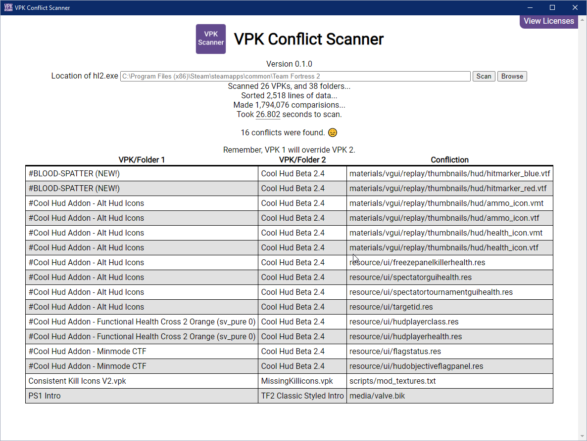

# VPK Conflict Scanner  

  

A tool to scan through folders and VPK files for Team Fortress 2, check to see if any files conflict with each other, then warn the user.

Requires access to VPK.exe in the bin folder of Team Fortress 2.
Currently only works on Windows.
Available in English only.

Speak a different language and can translate? Edit translations.json and submit a pull request.